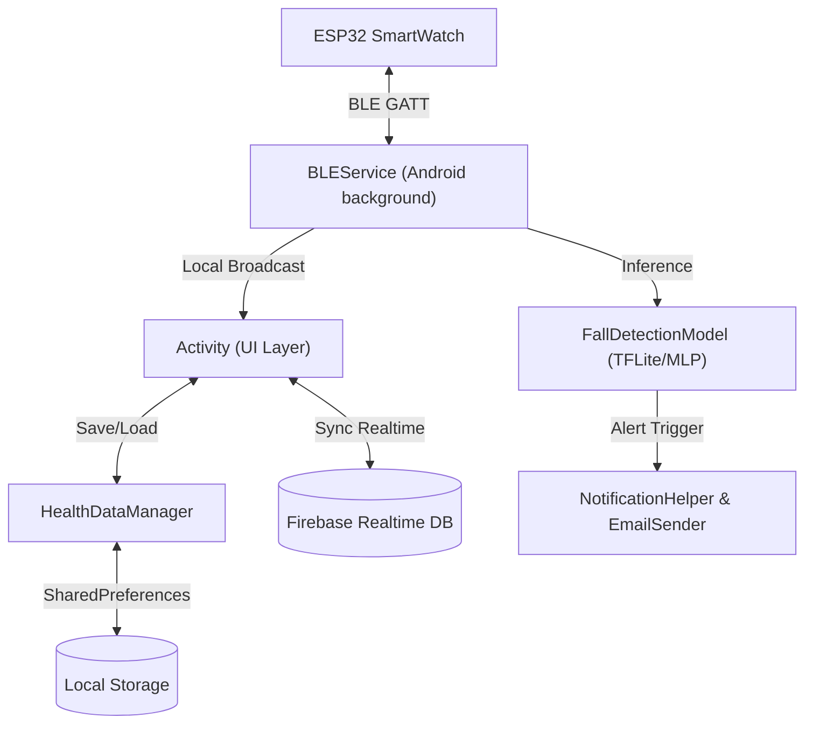
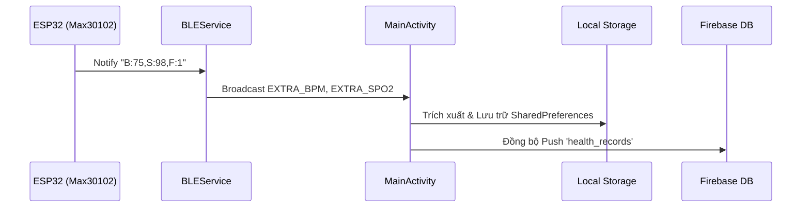
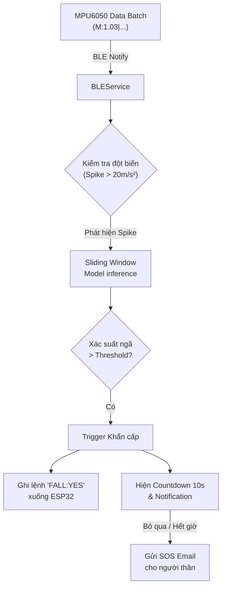
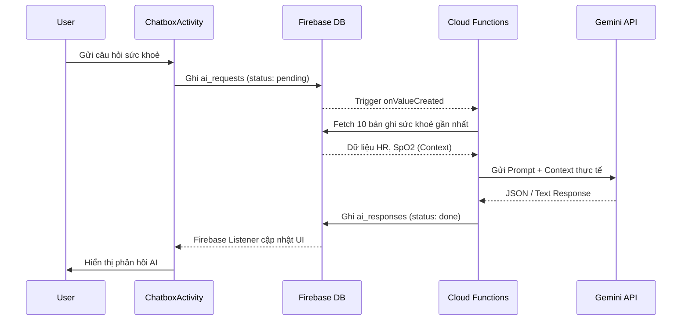

# SmartWatch Companion App (Android ESP32)

Ứng dụng Android Native kết nối qua Bluetooth Low Energy (BLE) với đồng hồ thông minh (ESP32). Thiết kế chuyên dụng để theo dõi sức khoẻ người dùng, đồng bộ dữ liệu thời gian thực, phát hiện cảnh báo té ngã (AI) và tích hợp AI Chatbot tư vấn sức khoẻ cá nhân hóa.

## 🚀 Tính năng chính (Features)

1. **Kết nối BLE & Quét thiết bị**:
   - Quét và ghép nối nhanh chóng với các thiết bị ESP32 SmartWatch.
   - Duy trì kết nối ngầm thông qua `BLEService` và tự động gửi/nhận dữ liệu.
   - Đồng bộ thời gian thực của điện thoại (`CHARACTERISTIC_DATETIME_UUID`) xuống ESP32.
2. **Theo dõi Nhịp tim (HR) và Nồng độ Oxy (SpO2)**:
   - Thu thập luồng dữ liệu Max30102 đo nhịp tim và oxy trong máu qua BLE.
   - Hiển thị trực quan dữ liệu, cảnh báo ngay khi các chỉ số vượt ngưỡng an toàn bằng Card View UI.
   - Lưu trữ dữ liệu bộ nhớ cục bộ bằng `HealthDataManager` kết hợp SharedPreferences (24 điểm dữ liệu gần nhất) để vẽ biểu đồ trực quan.
3. **Mô hình Phát hiện Té ngã (Fall Detection ML)**:
   - Sử dụng cảm biến gia tốc MPU6050 gửi batched data về ứng dụng.
   - Phân tích bằng mô hình mạng nơ-ron cục bộ với một sliding-window (512 mẫu tĩnh) để nhận diện xác suất ngã; chạy song song với "rule-based" phát hiện đột biến gia tốc (Spike detection).
   - Dialog Đếm ngược khẩn cấp (10s): tự động gửi email SOS tới người thân (`EmailSender` dùng JavaMail) với mô tả chi tiết nếu người dùng không phản hồi. Xử lý rung cảnh báo, phát âm thanh notification.
4. **Trợ lý sức khỏe AI Chatbot (Gemini)**:
   - Trò chuyện và tư vấn sức khoẻ dựa trên ngữ cảnh thực tế (chỉ số HR, SpO2 thu được gần nhất).
   - Pipeline bất đồng bộ kết nối qua Firebase Realtime Database và Firebase Cloud Functions xử lý Gemini 1.5 Flash.

## 📱 Giao diện (Interface)

- Ứng dụng được viết hoàn toàn bằng **Java** và **XML UI components**.
- **OnboardingActivity**: Giới thiệu ứng dụng thân thiện, đa ngôn ngữ. Tùy chỉnh ngôn ngữ bằng `LocaleHelper`.
- **MainActivity**: Dashboard trung tâm hiển thị:
  - Thời gian, ngày tháng hiện tại và pin thiết bị.
  - Các Card truy cập nhanh tới nhịp tim, oxy, phát hiện ngã, và cài đặt hiển thị nâng cao.
- **HeartRateActivity & OxygenActivity**: Biểu đồ hiển thị (`ChartView` Custom) tracking theo thời gian qua các dữ liệu parse.
- **ChatboxActivity**: Giao diện hội thoại tương tự các ứng dụng chat, phân tách bong bóng chat của user và bot (`item_chat_user.xml`, `item_chat_bot.xml`).
- **AdvancedSettingsActivity**: Quản lý liên hệ khẩn cấp và các tuỳ chọn ứng dụng bảo mật nâng cao.

## 🏛 Kiến trúc (Architecture)

- **Android Service Component**: `BLEService` là trung tâm của việc luân chuyển dữ liệu từ Hardware => Ứng dụng. GATT Client cho phép truyền / nhận bất đồng bộ.
- **LocalBroadcastManager**: `BLEService` truyền các sự kiện như `ACTION_DATA_AVAILABLE`, `ACTION_FALL_DETECTED` tới `MainActivity` không qua ràng buộc trực tiếp. 
- **Data Persistence**:
  - `SharedPreferences` cho việc lưu setting, mảng lịch sử ngã (Gson Object Serialization).
  - Giao tiếp thời gian thực 2 chiều với Firebase qua `ChildEventListener`.
- **Machine Learning Integration**:
  - Model weights được nén file nhị phân (`health_model.bin`) hoặc chuẩn TFLite.
  - Python scripts (`train_model.py`) trong root mô tả một model 4 in → 32 → 16 → 4 out MLP custom weights nén struct binary nhằm inference hiệu quả trên mobile edge.

## 🔀 Data Pipeline (Luồng Dữ liệu)

### 1. Pipeline Cảm biến Sinh hiệu (Max30102)

1. Hardware ESP32 phân giải tín hiệu cảm biến $\rightarrow$ gửi Gói tin ASCII qua BLE Char (`CHARACTERISTIC_HEALTH_UUID`), ví dụ: `"B:75,S:98,F:1"`.
2. `BLEService` parse chuỗi và local-broadcast `EXTRA_BPM`, `EXTRA_SPO2` qua Intent.
3. `MainActivity` cập nhật UI $\rightarrow$ `HealthDataManager` ghi vào local storage $\rightarrow$ Đẩy bản ghi (`health_records`) lên **Firebase Realtime DB** (lưu lại history cho AI Context).

### 2. Pipeline Cảm biến Ngã (MPU6050)

1. Gói dữ liệu batch (`"M:1.03|1.02|..."`) gửi sang BLE (`CHARACTERISTIC_MPU_UUID`).
2. `BLEService` bóc tách từng mẫu, convert sang $m/s^2$, cache mẫu gia tốc.
3. Nếu phát hiện gia tốc Spike vượt ngưỡng, kiểm tra bằng `FallDetectionModel.predict()`. Nếu xác suất cao $\rightarrow$ Trigger Fall Event.
4. Nếu té ngã, ESP32 sẽ nhận Command write `"FALL:YES"` để rung phần cứng. Trên Android chạy Foreground Notification Cảnh báo khẩn cấp, hiện Countdown UI, ghi Firebase Fall state, gửi alert Mail.

### 3. Pipeline AI Chatbot (Gemini)

1. `ChatboxActivity` đẩy câu user vào `ai_requests/{requestId}` với trạng thái `"pending"`.
2. **Cloud Functions** (`WatchApp_Backend/functions/index.js`) phát hiện node mới, thu thập 10 bản ghi sức khỏe gần nhất. Tổng hợp prompt $\rightarrow$ gửi **Google Gemini API**.
3. Kết quả trả về được lưu xuống `ai_responses/{requestId}` với trạng thái `"done"`.
4. App thông qua Firebase Listener bắt được event và hiển thị tin nhắn chatbot lên màn hình RecyclerView.
